# Terraform Cloud Run Tasks

This repository shows an example of run tasks with Terraform Cloud and Bridgecrew. This is to give you a quick idea of what run tasks can do. 

This that will do:
- Create a workspace
- Configure a bridgecrew run task
- See a plan with a mandatory run task
- See the same plan with an advisory run task

# Prerequisites

## Bridgecrew

Have a free account in bridgecrew to test

## AWS
We will be using AWS. Make sure you have the following
- AWS account  
- Install AWS cli [See documentation](https://docs.aws.amazon.com/cli/latest/userguide/install-cliv2.html)

## Install terraform  
See the following documentation [How to install Terraform](https://learn.hashicorp.com/tutorials/terraform/install-cli)

## Terraform Cloud

Have a terraform Cloud account. 

# How to

- Clone the repository to your local machine
```
git clone https://github.com/munnep/tfe_run_tasks.git
```
- Go to the directory workspace_creation
```
cd tfe_run_tasks/workspace_creation
```
- In the file `main.tf` change the organization name to your organization

```
resource "tfe_workspace" "test" {
  name         = "test_run_tasks"
  organization = "patrickmunne"
  tag_names    = ["test", "app"]
}
```

- Go to [bridgecrew](https://www.bridgecrew.cloud/) to connect a run task

[](https://www.bridgecrew.cloud/)   
- On the left go to integrations  
    
- Go to CI/CD systems and integrate an account  
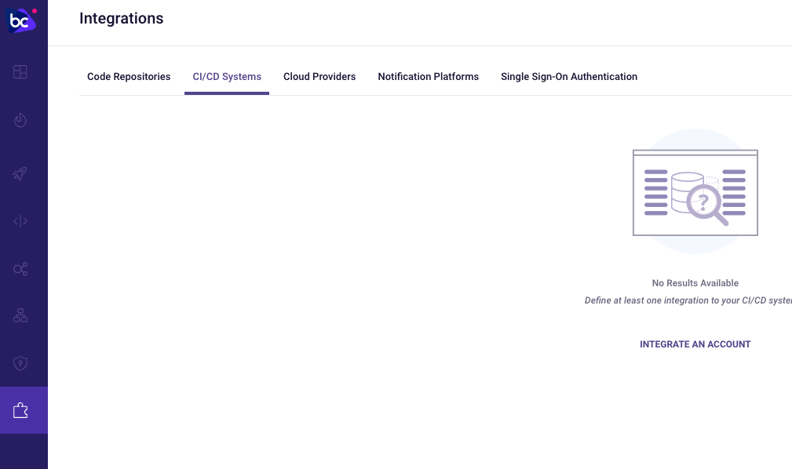    
- Choose Terraform Cloud (run tasks)  
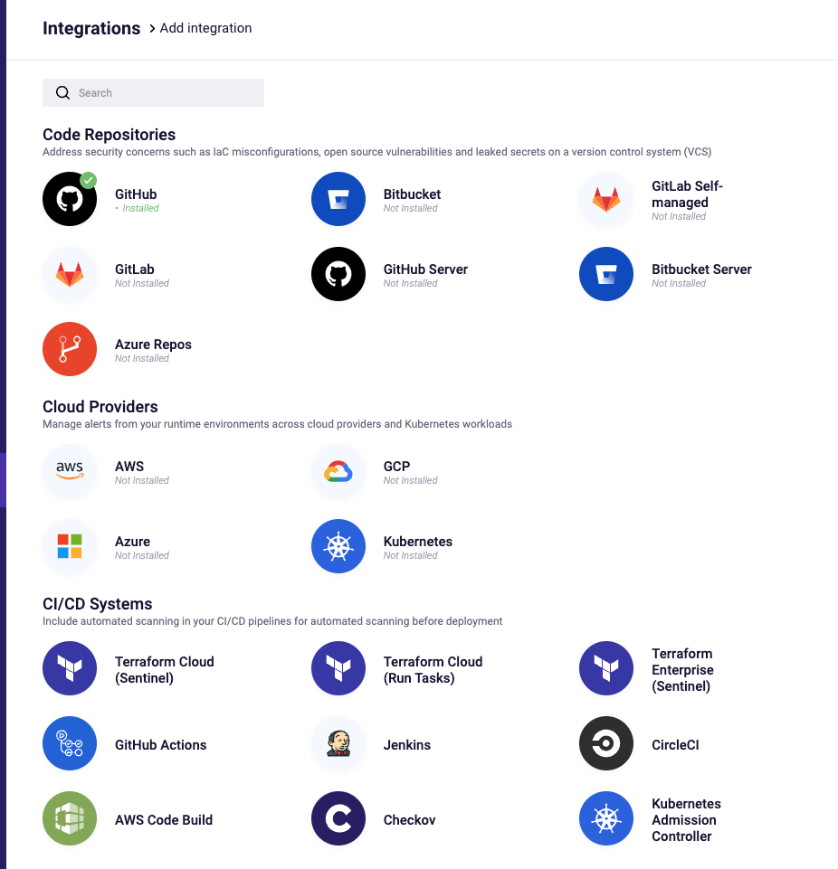    
- Add your token from Terraform Cloud   
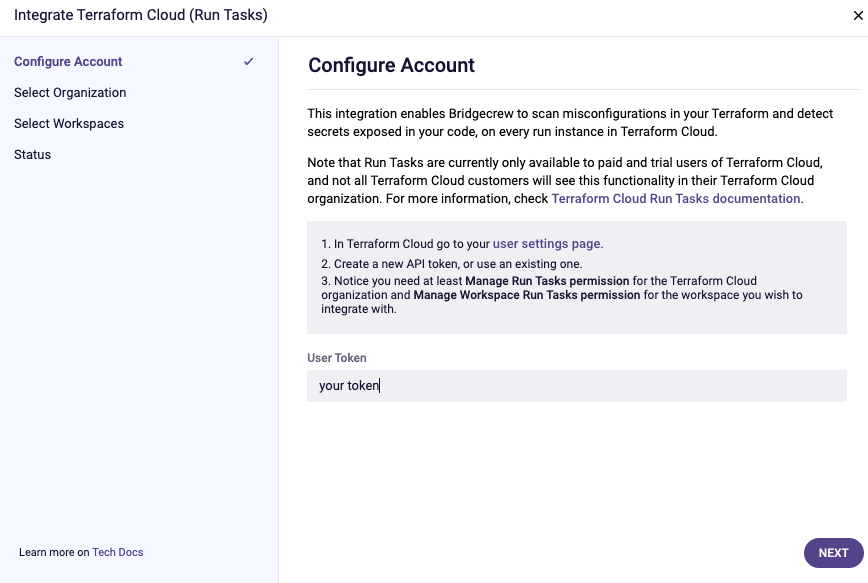    
- select your terraform Cloud organization   
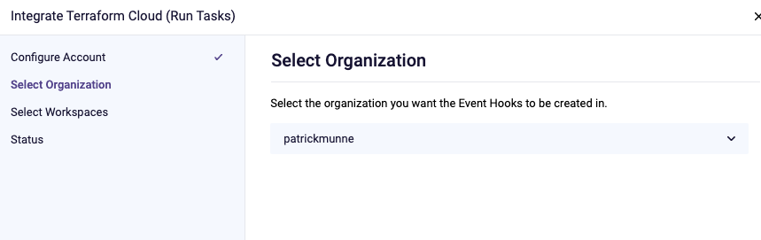    
- Select the workspace test_run_tasks  
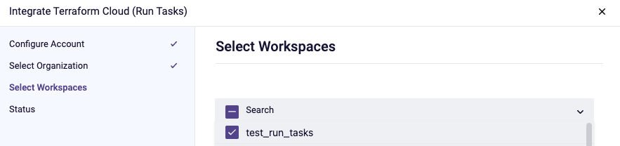    
- Should be configured correctly now   
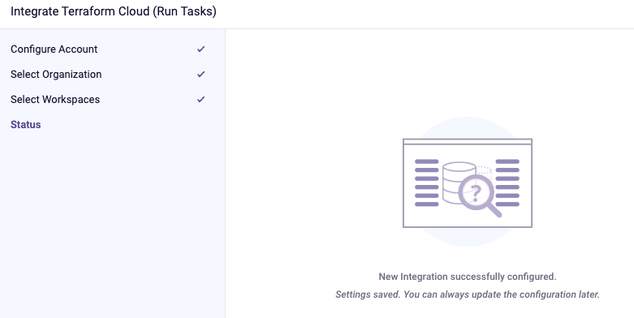    
- Login to Terraform Cloud. You should see the Bridgecrew run task configured now on the workspace `test_run_tasks`  
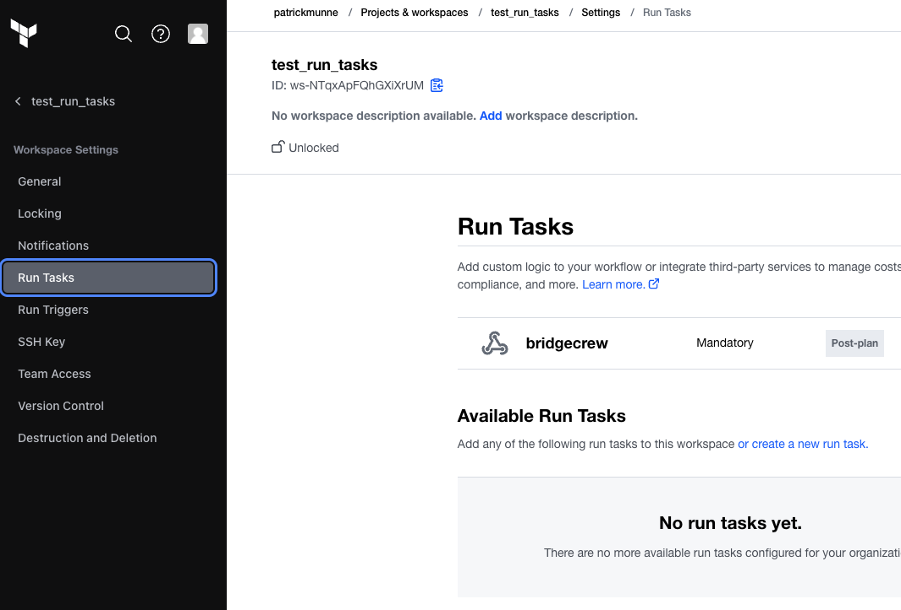    
- Make sure you have the proper credentials for AWS set on your workspace   
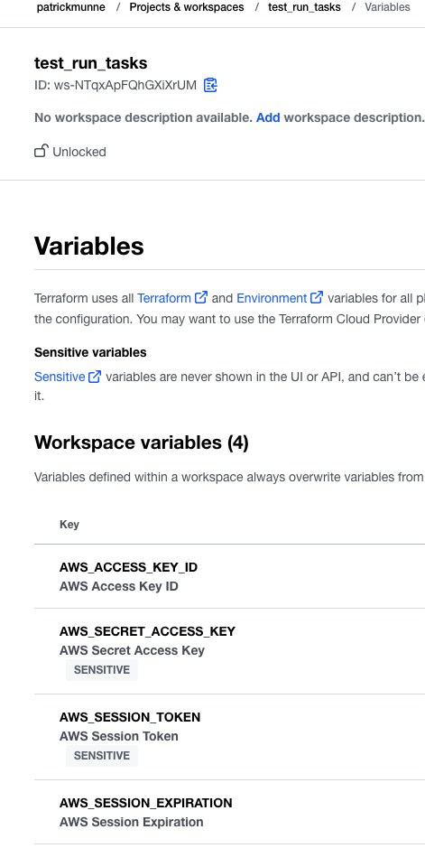    
- go to the directory `workspace_code`
- In the `main.tf` edit the organization to point to the one you use
```
terraform {
  cloud {
    organization = "patrickmunne"

    workspaces {
      name = "test_run_tasks"
    }
  }
}
```
- Run terraform init
```
terraform init
```
- Run terraform plan
```
terraform plan
```
- The output should show that bridgecrew test failed
```
Post-plan Tasks:

1 tasks still pending, 0 passed, 0 failed ...    (7s elapsed)
1 tasks still pending, 0 passed, 0 failed ...    (18s elapsed)
1 tasks still pending, 0 passed, 0 failed ...    (30s elapsed)
1 tasks still pending, 0 passed, 0 failed ...    (43s elapsed)
All tasks completed! 0 passed, 1 failed           (49s elapsed)

│ bridgecrew ⸺   Failed (Mandatory)
│ 11 resources were scanned, 8 errors were found
│ Details: https://www.bridgecrew.cloud/projects?repository=patrickmunne/test_run_tasks&branch=taskrs-VMZUD9DTTN6AwfMp_master&runId=latest
│ 
│ 
│ Overall Result: Failed

------------------------------------------------------------------------

╷
│ Error: the run failed because the run task, bridgecrew, is required to succeed
```

- The details of the bridgecrew error   

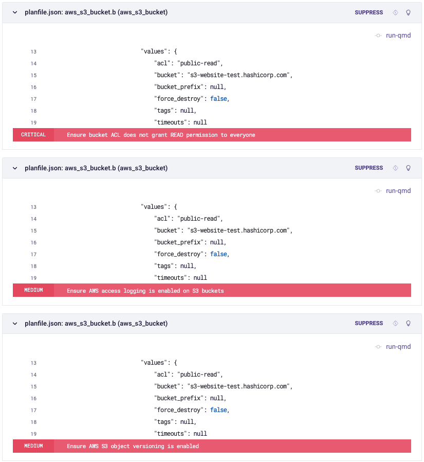    

- We accept the warnings and want to continue. You will want the Run Task to be Advisory
- Go to Terraform cloud -> Workspace `test_run_tasks` -> settings -> runs tasks  
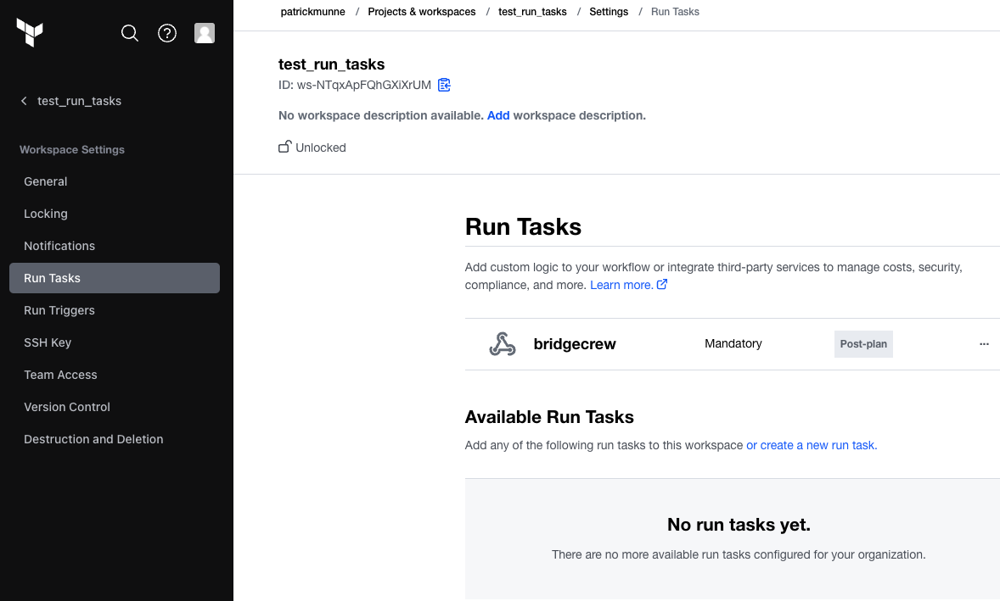  
- Select the bridgecrew run task and select `configure`  
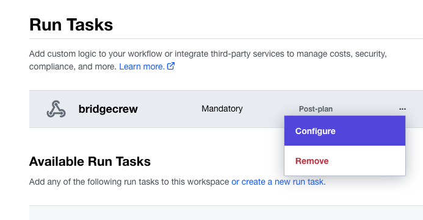    
- Change to `advisory` and save  
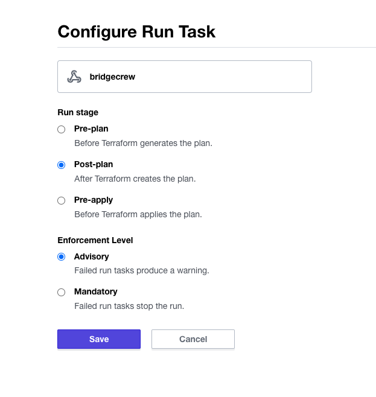    
- in a terminal go to the directory `workspace_code` 
- Execute terraform plan
```
terraform plan
```
- You still get a message about the issues found but you are able to execute it 
```
│ bridgecrew ⸺   Failed (Advisory)
│ 11 resources were scanned, 7 errors were found
│ Details: https://www.bridgecrew.cloud/projects?repository=patrickmunne/test_run_tasks&branch=taskrs-b16wCtEVgqFDKwa1_master&runId=latest
│ 
│ 
│ Overall Result: Passed with advisory failures
```

